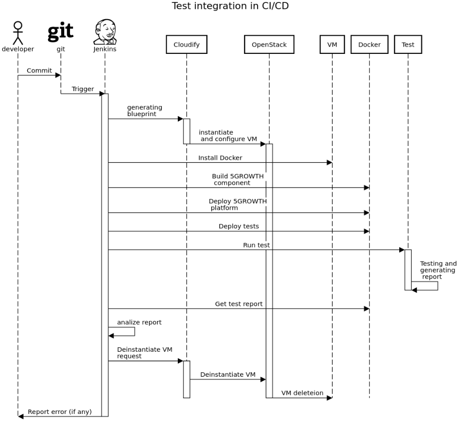
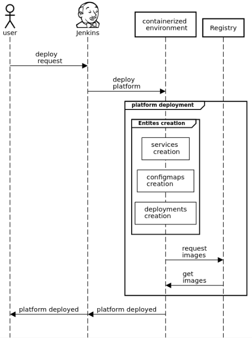

# Innovation 12 (I12): 5Growth CI/CD (MIRANTIS, R: SSSA)

The 5Growth CI/CD system is a software toolchain and combination of practices targeted to automate and simplify the development and deployment procedures for the 5Growth project. The 5Growth CI/CD, also mentioned as “5Growth CI/CD and containerization” in D2.2, consists of two parts: Continuous Integration (CI) responsible for automated testing of a new code, and Continuous Deployment (CD) responsible for simple, repeatable, and reliable deployment.

The high-level CI workflow is represented in The 5Growth CI/CD system is a software toolchain and combination of practices targeted to automate and simplify the development and deployment procedures for the 5Growth project. The 5Growth CI/CD, also mentioned as “5Growth CI/CD and containerization” in D2.2, consists of two parts:Continuous Integration (CI) responsible for automated testing of a new code, and Continuous Deployment (or Delivery) (CD) responsible for simple, repeatable and reliable deployment. 

The high-level CI workflow is represented in Figure 49. 

Figure 1: High-Level CI WorkFlow

Newly committed code automatically triggers the verification pipeline. Firstly, the pipeline pulls the last change from the git repository, then it creates the temporary test environment where the downloaded code is been built, deployed, and verified. The verification itself may include a set of automated tests, targeted to cover different aspects of the code quality assurance including integration testing, functional testing, and others. Depending on the verification result, the pipeline will either build needed artifacts or will finish the job by forming the failure report. Artifacts of the pipeline is a term describing the outcome of the code compilation, ready for being used as a matter for the deployment of the developed software. In this particular case artifacts would be docker images, that may be built, pushed to docker registry, and can be used for further deployments in case of a successful verification pass. The CI flow with test coverage can reduce the time for debugging in otherwise manually performed activities. This benefits the project and is considered the main goal of the 5Growth CI/CD activities.

The  high-level  CD workflow is  described in  Figure 50. 

Figure 50: High-Level CD Workflow

The CD workflow is highly customizable. The first option to choose is whether deployment will happen in the prearranged environment or instantiated by the CD pipeline. Then the user can choose parameters of the instantiated environment, like RAM amount, vCPU count, networking, etc. Then deploy the 5Growth platform on the chosen environment, using the general version for experiments or a dedicated pilot branch with customized configuration. 5Growth platform containerization was developed and implemented as a part of the 5Growth CI/CD initiative. This approach allowed to pack 5Growth platform in containers instead of software packages and go out of the virtual machine platform towards a container-based approach. This allowed the 5Growth stack to become a cloud-ready application. During automation deployment development for CI/CD, there were developed artefacts, that include automation scripts, orchestrators instructions, etc that can be used outside of the 5Tonic environment for 5Growth platform automated deployment. This allows the shipping of the platform as a whole. The 5Growth CI/CD architecture is depicted in Figure 51Figure 51. 

 

Figure 51: Improved 5Growth CI/CD Architecture

*   5Growth git repositories: This is a storage for the project codebase and a version control system, that allows project developers to contribute and collaborate. Jenkins continuously monitors 5Growth repositories for code changes and when it happens, the pipeline is being triggered.
*   CI/CD tool: Jenkins2 has a set of preconfigured Jobs united in a Pipeline, providing automation for stages in a flow such as environment preparation, verification, containerization, etc. The pipeline is responsible for requesting test environment instantiation via an infrastructure orchestrator. For this, the dedicated Jenkins Job generates an orchestrator blueprint and passes it to the orchestrator. 
*   Infrastructure orchestrator: it instantiates environment according to provided blueprint, received from the Pipeline, monitors instantiation progress and reports back when the environment is ready. Orchestrator's blueprint connects the test environment to a network with the dynamically assigned IP address. The assigned address should be passed to the Jenkins Pipeline to use this environment after instantiation. The orchestrator is also responsible for providing this address to the Pipeline.

The infrastructure orchestrator used for instantiating test environments on the OpenStack is Cloudify. Using the same orchestrator for CI/CD and 5Growth platform allows to reduce resource usage. For 5Growth platform deployment on Kubernetes no orchestration is needed because Kubernetes is an orchestrator for containers and the environment can be described with the K8s primitives' configuration. When the environment is ready, the pipeline takes control and installs prerequisites for platform deployment and deploy containerized 5Growth platform. 

*   Series of tests examine the deployed platform and generate a report. The pipeline analyzes test reports and makes a decision. Successfully verified code changes are being built, containerized, and stored for next usage, while failed changes are reported to the developers. 
*   Infrastructure itself is responsible for hosting test, demo, and development environments, CI/CD infrastructure, and 5Growth platform payload.

In the scope of the innovation, the 5Growth CI/CD was extended in the following ways:

**In containerization area:**

*   Orchestration extension to 5GrRowth platform deployment on Kubernetes.
*   Automation for Kubernetes deployment in CI/CD pipeline.

To extend containerized platform deployment stability and reliability there were deployed Kubernetes environment for hosting the 5Growth platform. To automate 5gGrowth platform deployment on Kubernetes there were pipelines developed. These Pipelines allow to simplify and automate deploy 5Ggrowth platform to Kubernetes environment.

**Environment area extension:**

*   developer's environment unification.
*   IaC (Infrastructure as code) environment preparation for development, testing, and pilots (if applicable).

The CI/CD performs 5Growth platform build, deployment, and test regularly. To automate and speed up these processes there was the need to make infrastructure instantiation a part of the CI/CD Pipeline. Jenkins Job that allows instantiating required infrastructure was developed and integrated into CI/CD pipeline. This Job is used in testing and deployment pipelines, and thus all the nodes instantiated by a Pipeline are the same. This approach brings repeatability and reusability to the project.

**Software testing area:**

*   Test coverage extension (automated testing pipelines extended with integration testing).

To Increase 5Growth CI/CD efficiency, it is important to verify interactions between 5Growth components. To cover this point there were different tests developed to verify deployment up and running or verify interactions between 5Growth platform components.

Thus, the 5Growth CI/CD features include the following:

*   Containerized 5Growth platform deployment automation.
*   Containerized 5Growth platform orchestration via Kubernetes.
*   IaC environments creation for development, testing, and deployment purposes.
*   Automated Pipeline trigger.
*   Automated environment creation.
*   Automated containerized components build.
*   Automated containerized deployment on the dedicated environment.
*   Automated tests run on the new deployment.
*   Automated notifications in case of failure.
*   Automated environment deinstantiation. 
*   Containerized 5Growth platform deployment automation.
*   Containerized 5Growth platform orchestration via Kubernetes.
*   IaC environments creation for development, testing, and deployment purposes.
*   Automated Pipeline trigger.
*   Automated environment creation.
*   Automated containerized components build.
*   Automated containerized deployment on the dedicated environment.
*   Automated tests run on the new deployment.
*   Automated notifications in case of failure.
*   Automated environment deinstantiation.

The Ddetailed CI workflow is showned in Figure 52.

Our automated CD pipeline allows decreasing deployment time. A set of measurements validating this claim are presented in in Section 4.13.

Figure 52: Detailed CI Workflow

### 5Growth Platform Deployment CI/CD
As described in Section 3.3.2, CI/CD includes the integration and deployment pipelines and platform containerization. Please refer to that section for more innovation details. The goal of this section is to evaluate CI/CD and containerization benefits in reducing the time and resources required by 5Growth platform deployment. The evaluation was conducted to compare two scenarios.
The goal of this section is to describe CI/CD 
a 5Growth platform deployment using a containerized 5Growth platform and CI/CD. This scenario considers the following 5Growth platform components and infrastructure deployment and don't include 5Gr-AIMLP and 5Gr-FBB components:
* VM instantiation
* 5Gr-VS;
* 5Gr-SO;
* 5Gr-RL;
* 5Gr-VoMS.
The overall deployment flow can be found in Figure 1. The 5Growth platform deployment using 5Growth CI/CD considers a platform deployment on a container capable environment (i.e., Kubernetes). For deployment, CD uses artefacts prepared on the CI stage. The CI flow and architecture are described in detail in Section 3.3.2. These artefacts include prebuilt images for every 5Growth component, configuration for 5Growth components and standard images, required by a deployment, and predefined Kubernetes manifests to put all things together.  
Based on the predefined Kubernetes manifests, the overall deployment pipeline will interact with the infrastructure orchestrator (Kubernetes) and passes instructions to it. Specifically, according to these instructions, the orchestrator will:
* Create entities (e.g., pods, services, configmaps, secrets);
* Establish network connections (e.g., IPs, DNS names, route external connections);
* Handle configuration options (e.g., mount cofigmap and secret entities); and
* Download images.

Figure 1: 5Growth CD Platform Deploment workFlow

